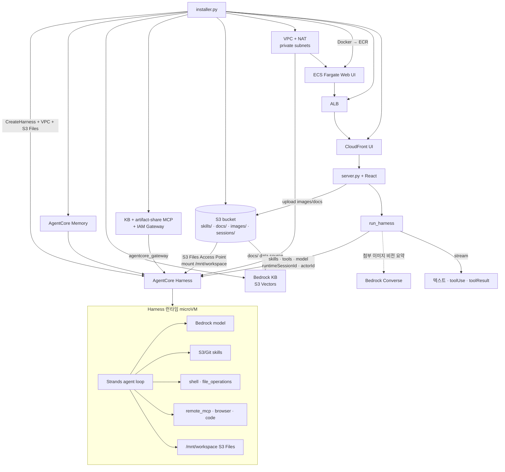

# AgentCore Harness

AgentCore의 관리형 에이전트 하네스(Managed Agent Harness)는 사전 구축 작업을 단순한 설정(configuration)으로 대체합니다.

이 저장소는 **인프라 프로비저닝(`installer.py`)** 과 **React + FastAPI UI(`application/`)** 로 구성됩니다. Harness는 VPC 모드 + Amazon S3 Files 마운트로 세션 스토리지를 붙이고, UI에서 고른 Skill·MCP·모델을 `InvokeHarness` 호출마다 override합니다. Web UI는 로컬 실행뿐 아니라 **Docker → ECR → ECS Fargate**(ALB + CloudFront)로도 배포합니다 (`strands-work`와 동일한 패턴).


## 주요 특징

- 모든 세션이 Firecracker microVM에서 격리 실행
- 세션별 독립 파일시스템 & 셸
- **S3 Files**로 `/mnt/workspace` 영속 마운트 (VPC 필수)
- **Skill**: Git(Anthropic 공식) 또는 S3 URI로 런타임에 주입
- **MCP / Browser / Code Interpreter**: UI 선택 → `tools` 배열로 전달
- **모델**: 사이드바 선택 → `model.bedrockModelConfig`로 호출마다 override
- **채팅 첨부**: `+` 버튼으로 이미지(사진·화면 캡처) 첨부, 문서 RAG 업로드
- **Knowledge Base**: S3 Vectors 기반 Bedrock KB (`docs/` 인제스션)
- **Artifact Share MCP**: `share_artifact`로 CloudFront 공유 URL (구 s3-sharing skill 대체)
- **Knowledge Graph**: 채팅 이력(`tasks.db`)에서 엔티티·관계를 추출해 사용자별 인터랙티브 HTML로 표시 (사이드바 브랜드 클릭)

AWS 오픈소스 에이전트 프레임워크 [Strands Agents](https://strandsagents.com/docs/user-guide/quickstart/python/)로 구동됩니다.


---

## Operation Architecture

로컬 UI는 Strands SDK를 직접 실행하지 않습니다. `installer.py`가 Control Plane에서 Harness·Memory·VPC·S3 Files를 만들고, Web UI를 ECS에 배포하면 CloudFront URL로 접속합니다. `run_harness`가 Data Plane `InvokeHarness`로 호출합니다.



| 단계 | 경로 |
|------|------|
| 프로비저닝 | `installer.py` → S3 · skills · IAM · Memory · **S3 Vectors KB** · **KB + artifact-share MCP Runtime + IAM Gateway** · VPC · S3 Files · `CreateHarness` · **ECR/ECS/ALB/UI CloudFront** → `application/config.json` |
| 호출 | React UI → Skill/MCP/모델 · **이미지 첨부** → SSE `/api/tasks/{id}/chat` → `run_harness` → `invoke_harness` |
| 삭제 | `uninstaller.py` → ECS/ALB/UI CF · Harness · MCP Gateway/Runtime · KB · S3 Vectors · S3 Files · VPC · Memory · IAM 정리 |

---

## 설치 / 실행

### A) ECS에 Web UI 배포 (권장, strands-work와 동일)

ARM64 호스트(예: `t4g` EC2)에서 Docker가 실행 중이어야 합니다. ECS Fargate 이미지는 `linux/arm64`로 빌드합니다.

```bash
# 1) Harness 인프라 + Web UI (Docker 빌드 → ECR → ECS)
pip install -r requirement.txt
python installer.py

# 이미지가 이미 ECR에 있으면 빌드 생략
python installer.py --skip-docker-build

# Harness만 만들고 ECS는 건너뛰기
python installer.py --skip-ecs

# 2) 배포 후 CloudFront URL로 접속 (installer 로그의 app_url / ui_cloudfront_domain)
#    https://xxxxx.cloudfront.net

# 3) 삭제 (ECS Web UI 포함)
python uninstaller.py
```

| 구성 | 설명 |
|------|------|
| Dockerfile | multi-stage: Node로 React 빌드 → Python/uvicorn :8501 |
| `ecs_web.py` | ECR · ECS Fargate · ALB · UI 전용 CloudFront |
| `APP_CONFIG_JSON` | ECS 태스크 환경변수 → entrypoint가 `application/config.json`에 기록 |
| S3 Files | ECS에도 `/mnt/app-data` 마운트 → `tasks.db` 영속 |

### B) 로컬에서 UI만 실행

```bash
# 1) 인프라 (최초 1회; ECS 없이 Harness만 필요하면 --skip-ecs)
python installer.py --skip-ecs

# 2) Python 의존성
pip install -r requirement.txt

# 3) React UI 빌드 후 FastAPI 서버 (http://localhost:8501)
./run_local.sh
# 또는:
#   cd application/web && npm install && npm run build
#   uvicorn application.server:app --host 0.0.0.0 --port 8501

# 4) 삭제
python uninstaller.py
```

`application/config.json`은 gitignore됩니다. installer가 `HARNESS_ARN`, `s3_bucket`, VPC·S3 Files, **Knowledge Base / S3 Vectors**, ECS(`app_url`) 필드를 채웁니다.

---

## 채팅 파일 · 이미지 업로드

채팅 입력창 **+** 버튼으로 이미지와 RAG 문서를 올릴 수 있습니다 (`harness-skills` / `agent-skills`와 동일한 UX).

| 메뉴 | 동작 |
|------|------|
| **사진 첨부** | png/jpeg/webp/gif — 파일 선택, **Ctrl/⌘+V 붙여넣기**, 드래그앤드롭 |
| **Upload to RAG** | pdf/txt/md/docx 등 → S3 `docs/{user_id}/` + Knowledge Base 인제스션 |

### 이미지 첨부 흐름

```text
[+ / paste / drop]
  → multipart POST /api/files/upload
  → S3 images/{user_id}/{name} + CloudFront URL
  → 첨부 칩(미리보기)에 URL 보관

[전송]
  → POST /api/tasks/{id}/chat  JSON { prompt, files: [cdnUrl, ...] }
  → task_store에 user 메시지 + images 저장
  → run_harness(..., files=files)
       · InvokeHarness content는 text만 지원
       · 첨부가 있으면 Bedrock Converse(비전)로 이미지 요약 후 프롬프트에 주입
       · invoke_harness(messages=[{text: enriched_prompt}])
```

프롬프트만 비어 있고 이미지만 있으면 기본 문구 `"첨부한 이미지를 분석해주세요."` 를 사용합니다.

### RAG 업로드 흐름

```text
[+ → Upload to RAG]
  → multipart POST /api/rag/upload
  → S3 docs/{user_id}/{file} (+ {file}.metadata.json)
  → StartIngestionJob (knowledge_base_id / data_source_id)
  → UI에 assistant 알림 메시지 (채팅 files에는 포함되지 않음)
```

`docs/` prefix는 installer가 만든 Bedrock Knowledge Base 데이터 소스의 `inclusionPrefixes`와 맞춥니다.

### 관련 API · 코드

| 경로 | 역할 |
|------|------|
| `POST /api/files/upload` | 채팅용 이미지 → S3 `images/` |
| `POST /api/rag/upload` | RAG 문서 → S3 `docs/` + KB sync |
| `POST /api/tasks/{id}/chat` | `{ prompt, files: string[] }` SSE |
| `application/web/src/components/ChatInput.tsx` | `+` 메뉴 · paste/drop · 첨부 칩 |
| `application/web/src/hooks/useFileUpload.ts` | 업로드 상태 · clipboard 이미지 |
| `application/api/routes_files.py` / `routes_rag.py` | 업로드 엔드포인트 |
| `application/services/rag_service.py` | KB 메타데이터 · 인제스션 |
| `application/agentcore_client.py` | `build_harness_prompt_with_files` (비전 요약) |

---

## S3 Files + VPC 설정

S3 Files 마운트는 **VPC 네트워크 모드**가 필요합니다. `s3_files_vpc.py`가 VPC(public/private + NAT)·S3 Files 파일시스템·Access Point·보안 그룹을 만들고, `installer.py`가 그 결과를 `CreateHarness`의 `environment`에 넣습니다.

### 프로비저닝 흐름 (`installer.py`)

```python
# installer.py main (요약)
s3_bucket_name = create_s3_bucket()          # versioning=Enabled (S3 Files 요구)
upload_skills_to_s3(s3_bucket_name)         # skills/ → s3://{bucket}/skills/
# … Knowledge Base (S3 Vectors + docs/ data source) …
execution_role_arn = create_harness_execution_role()
# … Memory …

provisioner = S3FilesVpcProvisioner(...)
vpc_info = provisioner.ensure_vpc()
s3_files_info = provisioner.create_s3_files_session_storage(
    vpc_info, s3_bucket_name, execution_role_arn, execution_role_name
)
harness_info = create_or_get_harness(
    execution_role_arn, agent_memory_arn, s3_files_info=s3_files_info
)
```

### Harness `environment` (VPC + 마운트)

```python
# s3_files_vpc.build_harness_runtime_environment
{
    "agentCoreRuntimeEnvironment": {
        "lifecycleConfiguration": {
            "idleRuntimeSessionTimeout": 600,
            "maxLifetime": 14400,
        },
        "networkConfiguration": {
            "networkMode": "VPC",
            "networkModeConfig": {
                "subnets": ["subnet-private-a", "subnet-private-b"],
                "securityGroups": ["sg-harness-runtime"],
            },
        },
        "filesystemConfigurations": [
            {
                "s3FilesAccessPoint": {
                    "accessPointArn": "arn:aws:s3files:...:access-point/fsap-...",
                    "mountPath": "/mnt/workspace",
                }
            }
        ],
    }
}
```

`CreateHarness` / `UpdateHarness` 호출 시:

```python
# installer.create_or_get_harness (요약)
environment = s3_files_vpc.build_harness_runtime_environment(s3_files_info)

agentcore_control_client.create_harness(
    harnessName=harness_api_name,
    executionRoleArn=execution_role_arn,
    # … model, tools, memory …
    environment=environment,
    environmentVariables={
        "LOG_LEVEL": "info",
        "SESSION_STORAGE_DIR": "/mnt/workspace",
    },
)
```

### 실행 역할에 필요한 권한 (요지)

| 영역 | 권한 |
|------|------|
| Bedrock | `bedrock:InvokeModel`, `InvokeModelWithResponseStream` |
| AgentCore | `bedrock-agentcore:*` |
| Skill S3 | `s3:ListBucket` / `s3:GetObject` on skills bucket |
| **VPC ECR pull** | `ecr:GetAuthorizationToken`, `ecr:BatchGetImage`, `GetDownloadUrlForLayer` on `repository/harness-*` |
| **S3 Files** | `s3files:ClientMount`, `ClientWrite`, `ClientRootAccess`, `GetAccessPoint`, `ListMountTargets` |

VPC 모드에서 managed harness 이미지(`…dkr.ecr…/harness-<region>:latest`)를 못 받으면 `Runtime health check failed`가 납니다. ECR 권한이 필수입니다.

### config.json에 저장되는 S3 Files 관련 키

```json
{
  "vpc_id": "vpc-…",
  "s3_files_file_system_id": "fs-…",
  "s3_files_access_point_arn": "arn:aws:s3files:…:access-point/fsap-…",
  "s3_files_mount_path": "/mnt/workspace",
  "agent_runtime_vpc_subnets": ["subnet-…"],
  "agent_runtime_security_groups": ["sg-…"],
  "HARNESS_ARN": "arn:aws:bedrock-agentcore:…:harness/…"
}
```

---

## Skill 구조

### 디렉터리 레이아웃

```
skills/
├── docx/                 # Anthropic git skill (이름만으로 git URL 매핑)
│   └── SKILL.md
├── pptx/ pdf/ xlsx/
└── korea-weather/        # 커스텀 → S3 URI로 전달
    ├── SKILL.md
    └── scripts/
        ├── get_weather.py
        └── recall_home_location.py

MCP/
├── knowledge-base/       # Bedrock KB retrieve (AgentCore Runtime MCP)
└── artifact-share/       # share_artifact → S3 + CloudFront 공유 URL
```

각 스킬은 Anthropic Agent Skills 스펙의 `SKILL.md`(YAML frontmatter + 본문)를 가집니다.

### 발견 (`application/skill.py`)

UI는 프로젝트 루트 `skills/`를 스캔합니다.

```python
# skill.py
PROJECT_ROOT = os.path.dirname(APPLICATION_DIR)
SKILLS_DIR = os.path.join(PROJECT_ROOT, "skills")

ANTHROPIC_GIT_SKILLS = {"docx", "pptx", "pdf", "xlsx"}
ANTHROPIC_SKILLS_GIT_URL = "https://github.com/anthropics/skills"
```

`SkillManager`가 `skills/*/SKILL.md`를 읽어 체크박스 목록을 만듭니다.

### InvokeHarness용 payload (`build_harness_skills`)

선택 이름이 Anthropic 세트의면 **git**, 아니면 **S3** URI를 씁니다.

```python
def build_harness_skills(skill_list: list[str]) -> list[dict]:
    s3_bucket = (utils.load_config() or {}).get("s3_bucket") or ""
    harness_skills = []
    for name in skill_list:
        if name in ANTHROPIC_GIT_SKILLS:
            harness_skills.append({
                "git": {
                    "url": ANTHROPIC_SKILLS_GIT_URL,
                    "path": f"skills/{name}",
                }
            })
        elif s3_bucket:
            harness_skills.append(
                {"s3": {"uri": f"s3://{s3_bucket}/skills/{name}/"}}
            )
        else:
            harness_skills.append({"path": f"skills/{name}"})
    return harness_skills
```

예시 결과:

```python
[
  {"git": {"url": "https://github.com/anthropics/skills", "path": "skills/docx"}},
  {"s3": {"uri": "s3://storage-for-harness-work-…/skills/korea-weather/"}},
]
```

### S3 업로드 (`installer.upload_skills_to_s3`)

```text
skills/korea-weather/SKILL.md
  → s3://{bucket}/skills/korea-weather/SKILL.md
skills/korea-weather/scripts/get_weather.py
  → s3://{bucket}/skills/korea-weather/scripts/get_weather.py
```

Harness 런타임에서 S3 스킬은 보통 다음 경로에 마운트됩니다.

```text
/home/.agents/skills/s3/korea-weather/scripts/get_weather.py
```

커스텀 스킬의 `SKILL.md`에는 **이 절대 경로**를 안내하세요. `$WORKING_DIR/skills/...`는 Harness S3 마운트에 없습니다.

### 커스텀 스킬 추가 절차

1. `skills/<name>/SKILL.md` (+ `scripts/` 등) 작성  
2. (선택) installer 재실행 또는 `aws s3 sync skills/<name> s3://{bucket}/skills/<name>/`  
3. React 사이드바 Skill 선택 → 다음 `InvokeHarness`에 `skills`로 전달  

---

## MCP / Tools 구조

### 카탈로그 (`application/mcp_config.py`)

UI 라벨 → Harness `tools` 항목:

```python
HARNESS_MCP_CATALOG = {
    "websearch": {
        "type": "remote_mcp",
        "name": "exa",
        "config": {"remoteMcp": {"url": "https://mcp.exa.ai/mcp"}},
    },
    "aws_documentation": {
        "type": "remote_mcp",
        "name": "aws_knowledge",
        "config": {
            "remoteMcp": {"url": "https://knowledge-mcp.global.api.aws"}
        },
    },
    "knowledge base": {
        # 같은 프로젝트 Gateway ARN (runtime에 config.json에서 채움)
        "type": "agentcore_gateway",
        "name": "knowledge_base",
        "config": {"agentCoreGateway": {"gatewayArn": ""}},
    },
    "artifact-share": {
        # knowledge base와 동일 Gateway (artifact-share Runtime target)
        "type": "agentcore_gateway",
        "name": "knowledge_base",
        "config": {"agentCoreGateway": {"gatewayArn": ""}},
    },
    "browser-use": {
        "type": "agentcore_browser",
        "name": "browser",
        "config": {"agentCoreBrowser": {}},
    },
    "code interpreter": {
        "type": "agentcore_code_interpreter",
        "name": "code",
        "config": {"agentCoreCodeInterpreter": {}},
    },
}
```

`build_harness_tools(selected_labels)`가 위 카탈로그를 합쳐 `tools` 배열을 만듭니다.
`knowledge base`와 `artifact-share`는 **하나의 프로젝트 IAM Gateway**에 연결됩니다 (라벨만 다르고 Gateway ARN은 공유).

### CreateHarness 기본 tools vs Invoke 시 override

`installer`가 Harness를 만들 때 기본 tools(exa, aws_knowledge, browser, code, knowledge_base Gateway)를 넣습니다. UI에서 고른 목록은 **호출마다** `InvokeHarness(tools=…)`로 override됩니다.

### Knowledge Base + Artifact Share MCP: Runtime + Gateway (IAM)

`MCP/knowledge-base/`와 `MCP/artifact-share/`를 각각 **AgentCore Runtime(MCP protocol, IAM 인증)** 으로 배포합니다. Harness가 Runtime을 **직접 `remote_mcp`로 연결할 수 없어** 프로젝트 공용 **AgentCore Gateway**(`name={projectName}`, 예: `harness-work`)를 두고, 두 Runtime을 Gateway **target**으로 붙인 뒤 Harness에는 `agentcore_gateway` 도구로 연결합니다.

#### 왜 Gateway가 필요한가

1. AgentCore Runtime MCP 엔드포인트는 기본이 **IAM SigV4**입니다.
2. Harness 도구 타입 `remote_mcp`는 URL(+ optional headers)만 받으며 **AWS SigV4 서명을 하지 않습니다**.
3. Runtime MCP URL을 `remote_mcp`로 등록하면 MCP 초기화에서 **HTTP 403 Forbidden**이 납니다.

#### 해결: Gateway가 SigV4를 중계

```text
Harness execution role
  --(SigV4 InvokeGateway)-->  AgentCore Gateway (authorizerType=AWS_IAM)
  --(SigV4, GATEWAY_IAM_ROLE)-->  KB MCP Runtime / Artifact Share MCP Runtime
```

| 구간 | 인증 | 담당 |
|------|------|------|
| Harness → Gateway | SigV4 (`InvokeGateway`) | Harness execution role + `outboundAuth.awsIam` |
| Gateway → Runtime MCP | SigV4 (`InvokeAgentRuntime`) | Gateway service role + target `GATEWAY_IAM_ROLE` |
| Runtime → Bedrock KB / S3 | Runtime task role | Retrieve / PutObject 등 |

#### installer가 만드는 리소스

| 리소스 | 이름 예 | 역할 |
|--------|---------|------|
| KB ECR + Runtime | `knowledge_base_of_harness_work` | `MCP/knowledge-base`, `retrieve` |
| Artifact Share ECR + Runtime | `artifact_share_of_harness_work` | `MCP/artifact-share`, `share_artifact` |
| Gateway | `harness-work` | 프로젝트 공용 inbound `AWS_IAM` |
| Gateway targets | `knowledge-base`, `artifact-share` | 각 Runtime MCP URL |

`application/config.json` 주요 키: `knowledge_base_mcp_*`, `artifact_share_mcp_*`, `agentcore_gateway_arn` / `id` / `role`.

산출물 공유는 예전 `skills/s3-sharing` 대신 **artifact-share MCP의 `share_artifact`** 를 사용합니다. 세션 파일은 `/mnt/workspace/{actor_id}/artifacts`에 두고, MCP가 S3 Files sync 재시도 후 CloudFront URL을 반환합니다.

관련 코드: `MCP/knowledge-base/`, `MCP/artifact-share/`, `installer.py` (`deploy_knowledge_base_mcp`, `deploy_artifact_share_mcp`, `ensure_project_agentcore_gateway`), `application/mcp_config.py`.

---

## UI → InvokeHarness 데이터 흐름

```text
React Sidebar (Skill · MCP · 모델 선택)
React ChatInput (+ 이미지 첨부 → files: CDN URL[])
   → chat.update(modelName)          # model_id 갱신
   → agentcore_client.run_harness(
         prompt,
         skill_list=[...],
         mcp_servers=[...],
         files=[...],                 # optional image CDN URLs
     )
```

```python
# agentcore_client.run_harness (요약)
skills = skill_mod.build_harness_skills(skill_list or [])
tools = mcp_config.build_harness_tools(mcp_servers or [])
model_cfg = chat_mod.harness_model_config()
# 예: {"bedrockModelConfig": {"modelId": "us.anthropic.claude-sonnet-5"}}
# OpenAI Mantle: apiFormat="responses" 포함

# files → 비전 요약 주입; actor_id → systemPrompt(ARTIFACTS_DIR) + actorId
effective_prompt = build_harness_prompt_with_files(prompt, files)
system_prompt = build_harness_system_prompt(actor_id)

invoke_kwargs = {
    "harnessArn": harness_arn,
    "runtimeSessionId": runtime_session_id,
    "actorId": actor_id,
    "model": model_cfg,
    "systemPrompt": system_prompt,
    "messages": [{"role": "user", "content": [{"text": effective_prompt}]}],
}
if skills:
    invoke_kwargs["skills"] = skills
if tools:
    invoke_kwargs["tools"] = tools

response = client.invoke_harness(**invoke_kwargs)
```

모델 목록·ID 매핑은 `application/info.py`, 선택 UI는 React Sidebar입니다.

---

## Harness 기본 구성 (installer)

| 항목 | 설정 |
|------|------|
| **기본 모델** | `global.anthropic.claude-opus-4-7` (호출 시 UI 모델로 override) |
| **systemPrompt** | 한국어 대화형 에이전트 안내 |
| **Memory** | AgentCore Memory (`agentCoreMemoryConfiguration`) |
| **대화 윈도우** | `sliding_window`, 최근 50 메시지 |
| **한도** | `maxIterations=20`, `maxTokens=50000`, `timeoutSeconds=300` |
| **네트워크** | `VPC` + private subnet + NAT |
| **파일시스템** | S3 Files → `/mnt/workspace` |
| **기본 tools** | exa, aws_knowledge, browser, code, **knowledge_base (Gateway)** |
| **Skills** | CreateHarness 시 미설정 → Invoke 시 UI 선택으로 주입 |
| **KB / Artifact MCP** | Runtime + 프로젝트 Gateway targets → `agentcore_gateway` |

---

## 도구 타입 참고

| 도구 타입 | 설명 |
|---|---|
| `remote_mcp` | URL로 원격 MCP 연결 (SigV4 없음 → **IAM AgentCore Runtime MCP에는 사용 불가**) |
| `agentcore_gateway` | Gateway ARN + IAM/OAuth (KB · artifact-share MCP는 이 경로) |
| `agentcore_browser` | 관리형 브라우저 |
| `agentcore_code_interpreter` | 샌드박스 코드 실행 |
| `inline_function` | 클라이언트 사이드 / HITL |

내장: `shell`, `file_operations` (제품 기본 제공).

---

## API / 스트리밍

| API | 설명 |
|---|---|
| [`CreateHarness`](https://docs.aws.amazon.com/boto3/latest/reference/services/bedrock-agentcore-control/client/create_harness.html) | 하네스 생성 |
| [`GetHarness`](https://docs.aws.amazon.com/boto3/latest/reference/services/bedrock-agentcore-control/client/get_harness.html) / `UpdateHarness` / `DeleteHarness` / `ListHarnesses` | 관리 |
| [`InvokeHarness`](https://docs.aws.amazon.com/boto3/latest/reference/services/bedrock-agentcore/client/invoke_harness.html) | 에이전트 호출 (스트리밍) |
| [`InvokeAgentRuntimeCommand`](https://docs.aws.amazon.com/boto3/latest/reference/services/bedrock-agentcore/client/invoke_agent_runtime_command.html) | 셸만 실행 |

### 스트림 이벤트

| 이벤트 | 설명 |
|---|---|
| `messageStart` / `messageStop` | 메시지 시작·종료 (`stopReason`) |
| `contentBlockStart` / `Delta` / `Stop` | text · toolUse · toolResult · reasoning |
| `metadata` | 토큰·지연 |
| `runtimeClientError` | 런타임 오류 |

`stopReason`: `end_turn`, `tool_use`, `max_tokens`, `max_iterations_exceeded`, `timeout_exceeded`, …

최소 호출 예시는 `test_invoke_harness.py`를 참고하세요.

---

## Knowledge Graph

채팅 이력을 Graphify 스타일 지식 그래프로 만듭니다. 상세는 [`graph/README.md`](./graph/README.md)를 참고하세요.

| 항목 | 내용 |
|------|------|
| 트리거 | 로그인 / 세션 복원 / 채팅 완료 / Settings에서 KG ON |
| UI | 사이드바 브랜드 클릭 → `GET /api/graph` iframe |
| 파이프라인 | `tasks.db` → corpus → LLM 추출 → `graph.html` |
| CLI | `cd graph && python run_pipeline.py --user <id>` |

---

## 저장소 구조

| 경로 | 역할 |
|---|---|
| `installer.py` | S3 · skills · IAM · Memory · VPC · S3 Files · CreateHarness · **ECS Web UI** |
| `ecs_web.py` | ECR · Docker 빌드 · ECS Fargate · ALB · UI CloudFront |
| `Dockerfile` / `docker-entrypoint.sh` | Web UI 컨테이너 이미지 |
| `uninstaller.py` | ECS/UI CF · MCP Gateway/Runtime · Harness · KB · VPC · IAM 등 정리 |
| `s3_files_vpc.py` | VPC / S3 Files / harness `environment` 빌더 |
| `skills/` | 로컬 스킬 소스 (→ S3 `skills/` 또는 Git) |
| `MCP/` | knowledge-base · artifact-share Runtime MCP 소스 |
| `graph/` | 채팅 이력 → Knowledge Graph 파이프라인 (`run_pipeline.py`) |
| `application/server.py` | FastAPI + React SPA (`application/web`) |
| `application/api/` | 세션 · 설정 · 태스크 · SSE 채팅 · **graph** API |
| `application/graph_jobs.py` | 로그인/채팅 후 백그라운드 그래프 추출 잡 |
| `application/agentcore_client.py` | `run_harness` / `invoke_harness` 스트림 처리 |
| `application/skill.py` | 스킬 발견 + `build_harness_skills` |
| `application/mcp_config.py` | MCP 카탈로그 + `build_harness_tools` |
| `application/chat.py` / `info.py` | 모델 선택·`harness_model_config` |
| `application/utils.py` | config / favorite_tools 로드 |
| `application/config.json` | 로컬/ECS 설정 (gitignore) |
| `test_invoke_harness.py` | CLI 스트리밍 호출 예시 |

```
사용자 → application/web (React) + application/server.py (FastAPI)
           → /api/tasks/{id}/chat (SSE)
           → skill / mcp_config / chat (선택값 → payload)
           → agentcore_client.run_harness
                 → InvokeHarness (skills · tools · model)
                       → AgentCore Harness (VPC + /mnt/workspace)
```

---

## 보안 요약

| 기능 | 설명 |
|---|---|
| 격리 실행 | Firecracker microVM |
| IAM 실행 역할 | Bedrock · ECR · S3 · S3 Files 최소 권한 |
| VPC | private subnet + NAT; S3 Files는 VPC 필수 |
| Memory | `actorId` 스코프 사용자 격리 |

호출 측: `bedrock-agentcore:InvokeHarness` (+ 관련 runtime 권한).

---

## 관련 문서

- [AgentCore Harness 개요](https://docs.aws.amazon.com/bedrock-agentcore/latest/devguide/harness.html)
- [Harness 시작하기](https://docs.aws.amazon.com/bedrock-agentcore/latest/devguide/harness-get-started.html)
- [Harness 모델](https://docs.aws.amazon.com/bedrock-agentcore/latest/devguide/harness-models.html)
- [Harness 보안 / 실행 역할](https://docs.aws.amazon.com/bedrock-agentcore/latest/devguide/harness-security.html)
- [AgentCore Observability](https://docs.aws.amazon.com/bedrock-agentcore/latest/devguide/observability.html)
- [AgentCore 요금](https://aws.amazon.com/bedrock/agentcore/pricing/)
- [Strands Agents](https://strandsagents.com/)
- [Boto3 CreateHarness](https://docs.aws.amazon.com/boto3/latest/reference/services/bedrock-agentcore-control/client/create_harness.html)
- [Boto3 InvokeHarness](https://docs.aws.amazon.com/boto3/latest/reference/services/bedrock-agentcore/client/invoke_harness.html)
