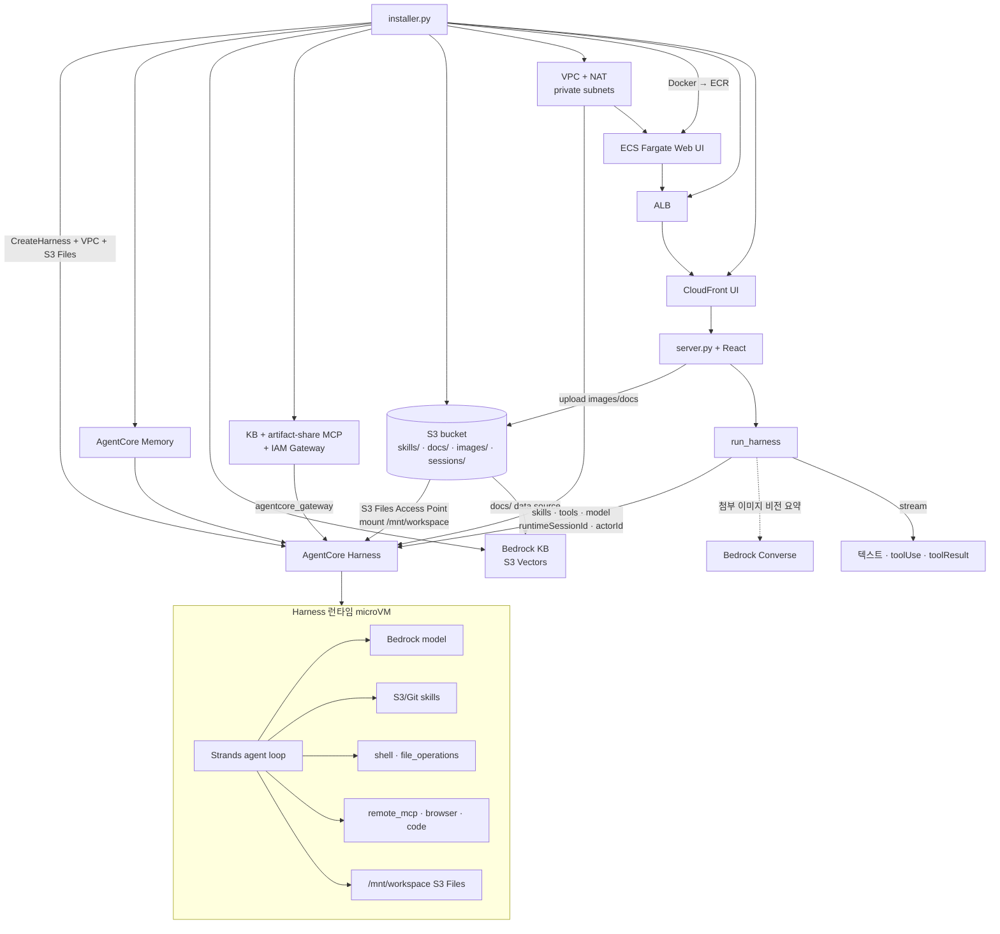
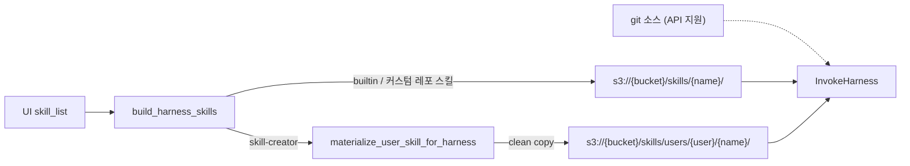
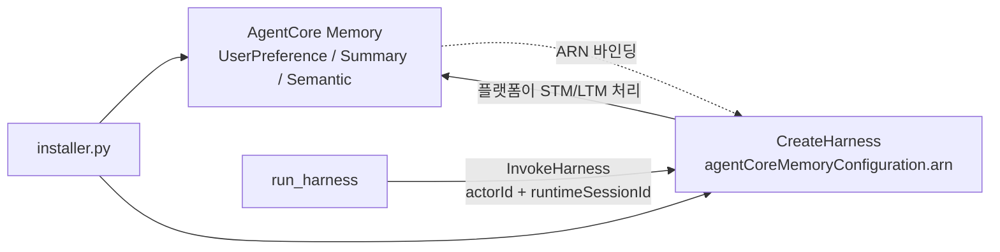

# AgentCore Harness Work

AgentCore의 관리형 에이전트 하네스(Managed Agent Harness)는 사전 구축 작업을 단순한 설정(configuration)으로 대체합니다.

이 저장소는 **인프라 프로비저닝(`installer.py`)** 과 **React + FastAPI UI(`application/`)** 로 구성됩니다. Harness는 VPC 모드 + Amazon S3 Files 마운트로 세션 스토리지를 붙이고, UI에서 고른 Skill·MCP·모델을 `InvokeHarness` 호출마다 override합니다. Web UI는 로컬 실행뿐 아니라 **Docker → ECR → ECS Fargate**(ALB + CloudFront)로도 배포합니다 (`strands-work`와 동일한 패턴).


## 주요 특징

- 모든 세션이 Firecracker microVM에서 격리 실행
- 세션별 독립 파일시스템 & 셸
- **Web UI 인증**: Amazon Cognito (`USER_PASSWORD_AUTH`) + HMAC 서명 세션 쿠키
- **S3 Files**로 `/mnt/workspace` 영속 마운트 (VPC 필수)
- **Skill**: Git(Anthropic 공식) 또는 S3 URI로 런타임에 주입
- **MCP / Browser / Code Interpreter**: UI 선택 → `tools` 배열로 전달
- **모델**: 사이드바 선택 → `model.bedrockModelConfig`로 호출마다 override
- **채팅 첨부**: `+` 버튼으로 이미지(사진·화면 캡처) 첨부, 문서 RAG 업로드
- **Knowledge Base**: S3 Vectors 기반 Bedrock KB (`docs/` 인제스션)
- **Artifact Share MCP**: `share_artifact`로 CloudFront 공유 URL (구 s3-sharing skill 대체)
- **Knowledge Graph**: 채팅 이력(`tasks.db`)에서 엔티티·관계를 추출해 사용자별 인터랙티브 HTML로 표시 (사이드바 브랜드 클릭)

AWS 오픈소스 에이전트 프레임워크 [Strands Agents](https://strandsagents.com/docs/user-guide/quickstart/python/)로 구동됩니다.


---

## Operation Architecture

로컬 UI는 Strands SDK를 직접 실행하지 않습니다. `installer.py`가 Control Plane에서 Harness·Memory·VPC·S3 Files를 만들고, Web UI를 ECS에 배포하면 CloudFront URL로 접속합니다. `run_harness`가 Data Plane `InvokeHarness`로 호출합니다.



| 단계 | 경로 |
|------|------|
| 프로비저닝 | `installer.py` → **Cognito User Pool** · S3 · skills · IAM · Memory · **S3 Vectors KB** · **KB + artifact-share MCP Runtime + IAM Gateway** · VPC · S3 Files · `CreateHarness` · **ECR/ECS/ALB/UI CloudFront** → `application/config.json` |
| 호출 | React UI → Cognito 로그인 · Skill/MCP/모델 · **이미지 첨부** → SSE `/api/tasks/{id}/chat` → `run_harness` → `invoke_harness` |
| 삭제 | `uninstaller.py` → Cognito · ECS/ALB/UI CF · Harness · MCP Gateway/Runtime · KB · S3 Vectors · S3 Files · VPC · Memory · IAM 정리 |

---

## 설치 / 실행

### A) ECS에 Web UI 배포 (권장, strands-work와 동일)

ARM64 호스트(예: `t4g` EC2)에서 Docker가 실행 중이어야 합니다. ECS Fargate 이미지는 `linux/arm64`로 빌드합니다.

```bash
# 1) Harness 인프라 + Web UI (Docker 빌드 → ECR → ECS)
#    설치 초기에 Cognito admin('admin') 비밀번호를 대화형으로 입력합니다.
#    (풀/admin이 이미 있으면 건너뜀)
pip install -r requirement.txt
python installer.py

# 이미지가 이미 ECR에 있으면 빌드 생략
python installer.py --skip-docker-build

# Harness만 만들고 ECS는 건너뛰기
python installer.py --skip-ecs

# 2) 배포 후 CloudFront URL로 접속 (installer 로그의 app_url / ui_cloudfront_domain)
#    https://xxxxx.cloudfront.net
#    Cognito 사용자명(admin 또는 add_user.py로 만든 계정)과 비밀번호로 로그인

# 3) (선택) 추가 Cognito 사용자
python add_user.py --username user01

# 4) 삭제 (ECS Web UI · Cognito 포함)
python uninstaller.py
```

| 구성 | 설명 |
|------|------|
| Dockerfile | multi-stage: Node로 React 빌드 → Python/uvicorn :8501 |
| `ecs_web.py` | ECR · ECS Fargate · ALB · UI 전용 CloudFront |
| `APP_CONFIG_JSON` | ECS 태스크 환경변수 → entrypoint가 `application/config.json`에 기록 |
| S3 Files | ECS는 **별도** `app-data/` FS를 `/mnt/app-data`에 마운트 (`tasks.db`·graph·settings). Harness는 `agentcore-sessions/` → `/mnt/workspace`. Skills는 S3 API |
| Cognito | User Pool + App Client (`USER_PASSWORD_AUTH`) · HMAC 세션 쿠키 |

### Cognito / 세션

| 항목 | 설명 |
|------|------|
| User Pool | 이름 = `projectName` (`harness-work`) |
| App Client | `{project}-web-ui`, `USER_PASSWORD_AUTH` |
| Admin | 사용자명 `admin` (installer가 비밀번호 입력받아 생성) |
| 세션 | HMAC 서명 쿠키 `agent_user_id` (`application/session_cookie.py`) |
| Signing key | Secrets Manager `{project}/session-signing-key` (없으면 로컬 파일 fallback) |
| 추가 사용자 | `python add_user.py` |

### B) 로컬에서 UI만 실행

```bash
# 1) 인프라 (최초 1회; ECS 없이 Harness만 필요하면 --skip-ecs)
python installer.py --skip-ecs

# 2) Python 의존성
pip install -r requirement.txt

# 3) React UI 빌드 후 FastAPI 서버 (http://localhost:8501)
./run_local.sh
# 또는:
#   cd application/web && npm install && npm run build
#   uvicorn application.server:app --host 0.0.0.0 --port 8501

# 4) (선택) 추가 Cognito 사용자
python add_user.py --username user01

# 5) 삭제
python uninstaller.py
```

브라우저에서 Cognito 사용자명(`admin` 또는 `add_user.py`로 만든 계정)과 비밀번호로 로그인합니다.

`application/config.json`은 gitignore됩니다. installer가 `HARNESS_ARN`, `s3_bucket`, VPC·S3 Files, **Cognito**, **Knowledge Base / S3 Vectors**, ECS(`app_url`) 필드를 채웁니다.

---

## 채팅 파일 · 이미지 업로드

채팅 입력창 **+** 버튼으로 이미지와 RAG 문서를 올릴 수 있습니다 (`harness-skills` / `agent-skills`와 동일한 UX).

| 메뉴 | 동작 |
|------|------|
| **사진 첨부** | png/jpeg/webp/gif — 파일 선택, **Ctrl/⌘+V 붙여넣기**, 드래그앤드롭 |
| **Upload to RAG** | pdf/txt/md/docx 등 → S3 `docs/{user_id}/` + Knowledge Base 인제스션 |

### 이미지 첨부 흐름

```text
[+ / paste / drop]
  → multipart POST /api/files/upload
  → S3 images/{user_id}/{name} + CloudFront URL
  → 첨부 칩(미리보기)에 URL 보관

[전송]
  → POST /api/tasks/{id}/chat  JSON { prompt, files: [cdnUrl, ...] }
  → task_store에 user 메시지 + images 저장
  → run_harness(..., files=files)
       · InvokeHarness content는 text만 지원
       · 첨부가 있으면 Bedrock Converse(비전)로 이미지 요약 후 프롬프트에 주입
       · invoke_harness(messages=[{text: enriched_prompt}])
```

프롬프트만 비어 있고 이미지만 있으면 기본 문구 `"첨부한 이미지를 분석해주세요."` 를 사용합니다.

### RAG 업로드 흐름

```text
[+ → Upload to RAG]
  → multipart POST /api/rag/upload
  → S3 docs/{user_id}/{file} (+ {file}.metadata.json)
  → StartIngestionJob (knowledge_base_id / data_source_id)
  → UI에 assistant 알림 메시지 (채팅 files에는 포함되지 않음)
```

`docs/` prefix는 installer가 만든 Bedrock Knowledge Base 데이터 소스의 `inclusionPrefixes`와 맞춥니다.

### 관련 API · 코드

| 경로 | 역할 |
|------|------|
| `POST /api/files/upload` | 채팅용 이미지 → S3 `images/` |
| `POST /api/rag/upload` | RAG 문서 → S3 `docs/` + KB sync |
| `POST /api/tasks/{id}/chat` | `{ prompt, files: string[] }` SSE |
| `application/web/src/components/ChatInput.tsx` | `+` 메뉴 · paste/drop · 첨부 칩 |
| `application/web/src/hooks/useFileUpload.ts` | 업로드 상태 · clipboard 이미지 |
| `application/api/routes_files.py` / `routes_rag.py` | 업로드 엔드포인트 |
| `application/services/rag_service.py` | KB 메타데이터 · 인제스션 |
| `application/agentcore_client.py` | `build_harness_prompt_with_files` (비전 요약) |

---

## S3 Files + VPC 설정

S3 Files 마운트는 **VPC 네트워크 모드**가 필요합니다. `s3_files_vpc.py`가 VPC(public/private + NAT)·**두 개의** S3 Files 파일시스템·Access Point·보안 그룹을 만듭니다.

| FS prefix | 마운트 | 소비자 | 내용 |
|-----------|--------|--------|------|
| `agentcore-sessions/` | `/mnt/workspace` | Harness runtime | artifacts, skill-creator skills |
| `app-data/` | `/mnt/app-data` | ECS Web UI only | `tasks.db`, graph, settings |

Harness IAM은 `app-data/*`에 Deny가 걸려 있어 에이전트가 채팅 DB를 읽을 수 없습니다. UI의 user skills 목록은 `agentcore-sessions/{user}/skills/`를 **S3 API**로 조회합니다.

### 프로비저닝 흐름 (`installer.py`)

```python
# installer.py main (요약)
s3_bucket_name = create_s3_bucket()          # versioning=Enabled (S3 Files 요구)
upload_skills_to_s3(s3_bucket_name)         # skills/ → s3://{bucket}/skills/
# … Knowledge Base (S3 Vectors + docs/ data source) …
execution_role_arn = create_harness_execution_role()
# … Memory …

provisioner = S3FilesVpcProvisioner(...)
vpc_info = provisioner.ensure_vpc()
s3_files_info = provisioner.create_s3_files_session_storage(
    vpc_info, s3_bucket_name, execution_role_arn, execution_role_name
)
app_data_info = provisioner.create_s3_files_app_data_storage(
    vpc_info, s3_bucket_name, mount_sg_id=s3_files_info["mount_sg_id"]
)
harness_info = create_or_get_harness(
    execution_role_arn, agent_memory_arn, s3_files_info=s3_files_info
)
# ECS mounts app_data_info only (not session FS)
```

### Harness `environment` (VPC + 마운트)

```python
# s3_files_vpc.build_harness_runtime_environment
{
    "agentCoreRuntimeEnvironment": {
        "lifecycleConfiguration": {
            "idleRuntimeSessionTimeout": 600,
            "maxLifetime": 14400,
        },
        "networkConfiguration": {
            "networkMode": "VPC",
            "networkModeConfig": {
                "subnets": ["subnet-private-a", "subnet-private-b"],
                "securityGroups": ["sg-harness-runtime"],
            },
        },
        "filesystemConfigurations": [
            {
                "s3FilesAccessPoint": {
                    "accessPointArn": "arn:aws:s3files:...:access-point/fsap-...",
                    "mountPath": "/mnt/workspace",
                }
            }
        ],
    }
}
```

`CreateHarness` / `UpdateHarness` 호출 시:

```python
# installer.create_or_get_harness (요약)
environment = s3_files_vpc.build_harness_runtime_environment(s3_files_info)

agentcore_control_client.create_harness(
    harnessName=harness_api_name,
    executionRoleArn=execution_role_arn,
    # … model, tools, memory …
    environment=environment,
    environmentVariables={
        "LOG_LEVEL": "info",
        "SESSION_STORAGE_DIR": "/mnt/workspace",
    },
)
```

### 실행 역할에 필요한 권한 (요지)

| 영역 | 권한 |
|------|------|
| Bedrock | `bedrock:InvokeModel`, `InvokeModelWithResponseStream` |
| AgentCore | `bedrock-agentcore:*` |
| Skill S3 | `s3:ListBucket` / `s3:GetObject` on skills bucket |
| **VPC ECR pull** | `ecr:GetAuthorizationToken`, `ecr:BatchGetImage`, `GetDownloadUrlForLayer` on `repository/harness-*` |
| **S3 Files** | `s3files:ClientMount`, `ClientWrite`, `ClientRootAccess`, `GetAccessPoint`, `ListMountTargets` |

VPC 모드에서 managed harness 이미지(`…dkr.ecr…/harness-<region>:latest`)를 못 받으면 `Runtime health check failed`가 납니다. ECR 권한이 필수입니다.

### config.json에 저장되는 S3 Files 관련 키

```json
{
  "vpc_id": "vpc-…",
  "s3_files_file_system_id": "fs-…",
  "s3_files_access_point_arn": "arn:aws:s3files:…:access-point/fsap-…",
  "s3_files_mount_path": "/mnt/workspace",
  "s3_files_app_data_file_system_id": "fs-…",
  "s3_files_app_data_access_point_arn": "arn:aws:s3files:…:access-point/fsap-…",
  "s3_files_app_data_mount_path": "/mnt/app-data",
  "agent_runtime_vpc_subnets": ["subnet-…"],
  "agent_runtime_security_groups": ["sg-…"],
  "HARNESS_ARN": "arn:aws:bedrock-agentcore:…:harness/…"
}
```

---

## Skill 구조

### 디렉터리 레이아웃

```
skills/
├── docx/ pptx/ pdf/ xlsx/   # 수정본 → installer가 S3 skills/ 로 업로드
├── skill-creator/
└── korea-weather/           # 커스텀 → 동일하게 S3 skills/ 로 전달
    ├── SKILL.md
    └── scripts/
        ├── get_weather.py
        └── recall_home_location.py
```

각 스킬은 Anthropic Agent Skills 스펙의 `SKILL.md`(YAML frontmatter + 본문)를 가집니다.

### 발견 (`application/skill.py`)

UI는 프로젝트 루트 `skills/`와 (로그인 시) skill-creator 세션 스킬을 스캔합니다.  
`SkillManager`가 `skills/*/SKILL.md`를 읽어 체크박스 목록을 만듭니다.

### InvokeHarness용 payload

선택 스킬 → `skills` 배열 매핑은 [`build_harness_skills`](#harness-skills) 를 참고하세요.

### S3 업로드 (`installer.upload_skills_to_s3`)

```text
skills/korea-weather/SKILL.md
  → s3://{bucket}/skills/korea-weather/SKILL.md
skills/korea-weather/scripts/get_weather.py
  → s3://{bucket}/skills/korea-weather/scripts/get_weather.py
```

Harness 런타임에서 S3 스킬은 보통 다음 경로에 마운트됩니다.

```text
/home/.agents/skills/s3/korea-weather/scripts/get_weather.py
```

커스텀 스킬의 `SKILL.md`에는 **이 절대 경로**를 안내하세요. `$WORKING_DIR/skills/...`는 Harness S3 마운트에 없습니다.

### 커스텀 스킬 추가 절차

1. `skills/<name>/SKILL.md` (+ `scripts/` 등) 작성  
2. (선택) installer 재실행 또는 `aws s3 sync skills/<name> s3://{bucket}/skills/<name>/`  
3. React 사이드바 Skill 선택 → 다음 `InvokeHarness`에 `skills`로 전달  

---

## Harness Skills

`application/skill.py`의 `build_harness_skills(skill_list, user_id)`가 UI에서 고른 스킬 이름을  
`InvokeHarness`의 `skills` payload로 바꿉니다. 소스는 크게 세 가지입니다.



### 1) S3로 복사한 skills 활용 (기본)

레포 `skills/<name>/`를 installer가 버킷에 올리고, invoke 시 그 URI를 붙입니다.

| 단계 | 내용 |
|------|------|
| 업로드 | `installer.upload_skills_to_s3` → `s3://{bucket}/skills/<name>/` |
| 대상 | `docx`, `pptx`, `pdf`, `xlsx`, `skill-creator`, `korea-weather` 등 **로컬 `skills/`에 있는 이름** |
| payload | `{"s3": {"uri": "s3://{bucket}/skills/{name}/"}}` |

```text
skills/korea-weather/SKILL.md
  → s3://{bucket}/skills/korea-weather/SKILL.md
runtime mount
  → /home/.agents/skills/s3/korea-weather/...
```

이 프로젝트는 Anthropic 공식 스킬도 **git 대신** 수정본을 S3에 올려 씁니다 (`build_harness_skills` docstring: runtime uses those copies—not git).

### 2) GitHub에서 가져오는 방법

`InvokeHarness`는 S3뿐 아니라 **git 소스**도 받습니다. 업스트림을 그대로 쓸 때:

```python
{
    "git": {
        "url": "https://github.com/anthropics/skills",
        "path": "skills/docx",   # 또는 pptx / pdf / xlsx
    }
}
```

| 항목 | 값 |
|------|-----|
| 저장소 | [anthropics/skills](https://github.com/anthropics/skills) |
| path | `skills/<name>` (`docx`, `pptx`, `pdf`, `xlsx` 등) |

현재 `build_harness_skills`는 git 분기를 쓰지 않고 **1번 S3 복사본**을 기본으로 합니다.  
공식 원본을 쓰고 싶으면 payload에 위 `git` 객체를 넣으면 됩니다 (로컬 `SKILL.md` 수정분은 반영되지 않음).

### 3) skill-creator → session storage 스킬 활용

skill-creator가 만든 스킬은 사용자 세션 스토리지에 저장됩니다.

| 단계 | 경로 |
|------|------|
| 작성 위치 (런타임) | `/mnt/workspace/{user_id}/skills/<name>/` |
| S3 Files 대응 | `s3://{bucket}/agentcore-sessions/{user_id}/skills/<name>/` |
| UI 목록 | 로컬 mount 또는 S3에서 `SKILL.md` 있는 디렉터리 스캔 |
| Invoke 직전 | `materialize_user_skill_for_harness`가 **clean copy** 생성 |

판별 (`build_harness_skills`):

- `user_id`가 있고, 해당 이름이 **builtin `skills/`에 없거나** session/S3에 user skill로 존재하면 → user skill 경로
- 그 외 builtin → `s3://{bucket}/skills/{name}/`

clean copy 규칙:

- 소스: `agentcore-sessions/{user}/skills/{name}/`
- 대상: `s3://{bucket}/skills/users/{user}/{name}/`
- **제외**: S3 Files 디렉터리 마커(`*/` 0바이트), 루트 `evals/` (Errno 17 방지)
- payload: `{"s3": {"uri": "s3://{bucket}/skills/users/{user}/{name}/"}}`

예시 (`user_id=ksdyb`, `system-monitor` 선택):

```python
[
  {"s3": {"uri": "s3://…/skills/docx/"}},
  {"s3": {"uri": "s3://…/skills/users/ksdyb/system-monitor/"}},
]
```

materialize 실패 시에만 raw `agentcore-sessions/.../skills/{name}/` URI로 fallback합니다 (마커가 있으면 런타임 추출이 실패할 수 있음).

### 요약

| 출처 | S3 / Git URI | 비고 |
|------|----------------|------|
| 레포 `skills/` (installer) | `s3://{bucket}/skills/{name}/` | 기본 경로 |
| GitHub anthropics/skills | `git.url` + `git.path` | API 지원, 현재 코드는 미사용 |
| skill-creator (session) | `s3://{bucket}/skills/users/{user}/{name}/` | session에서 clean copy 후 부착 |

구현: `application/skill.py` — `build_harness_skills`, `materialize_user_skill_for_harness`.

---

## Harness 환경 제한

AgentCore Harness microVM에서 에이전트가 실제로 쓸 수 있는 런타임은 로컬 Mac/Linux와 다릅니다.  
`SKILL.md`·스크립트·시스템 프롬프트(`agentcore_client._HARNESS_SYSTEM_PROMPT_BASE`)는 아래 제약을 전제로 작성하세요.

### Node.js / npm 미지원 → Python 사용

| 금지 | 대안 |
|------|------|
| `node`, `npm`, `npx` | `python3` |
| `docx` (npm) / docx-js | `python-docx` |
| `pptxgenjs` / react-icons | `python-pptx` |

- Node 바이너리가 없어 `command not found` / exit 127로 끝납니다.
- 문서·슬라이드·스프레드시트는 **처음부터 Python**으로 생성하세요. Node 경로를 “있는지 확인”하는 probe도 하지 마세요.

### `pip` 없음 → `pip3` 명시

| 금지 | 사용 |
|------|------|
| `pip install …` | `pip3 install …` |
| `pip show …` | `pip3 show …` |

예시:

```bash
pip3 install python-docx
pip3 install python-pptx
pip3 install openpyxl
```

패키지 import 실패 시에도 `pip`가 아니라 `pip3`로 설치한 뒤 바로 재실행합니다.

### 경로·산출물

| 항목 | 올바른 위치 |
|------|-------------|
| S3로 주입된 스킬 스크립트 | `/home/.agents/skills/s3/<skill-name>/…` |
| 세션 영속 스토리지 | `/mnt/workspace` (S3 Files) |
| 산출물 (PDF, DOCX, PNG 등) | `/mnt/workspace/{actor_id}/artifacts/` |

- `$WORKING_DIR/skills/...`, `skills/...` 상대경로는 Harness에 **없습니다**.
- skill-creator가 만든 스킬은 워크스페이스의 `…/skills/<name>/`에 두고, Invoke 시에는 마커/`evals/`를 제거한  
  `s3://{bucket}/skills/users/{user_id}/{name}/` 로 붙여집니다.

### 기타

- **InvokeHarness image content block 미지원** — UI 첨부 이미지는 Bedrock 비전 요약 후 텍스트로 주입합니다.
- S3 Files에서 `mkdir`로 생긴 **0바이트 디렉터리 마커**(`evals/` 등)를 그대로 skill URI로 붙이면  
  런타임 추출이 `[Errno 17] File exists: .../evals` 로 실패할 수 있습니다 (위 clean copy로 회피).

---

## MCP / Tools 구조

### 카탈로그 (`application/mcp_config.py`)

UI 라벨 → Harness `tools` 항목:

```python
HARNESS_MCP_CATALOG = {
    "websearch": {
        "type": "remote_mcp",
        "name": "exa",
        "config": {"remoteMcp": {"url": "https://mcp.exa.ai/mcp"}},
    },
    "aws_documentation": {
        "type": "remote_mcp",
        "name": "aws_knowledge",
        "config": {
            "remoteMcp": {"url": "https://knowledge-mcp.global.api.aws"}
        },
    },
    "knowledge base": {
        # 같은 프로젝트 Gateway ARN (runtime에 config.json에서 채움)
        "type": "agentcore_gateway",
        "name": "knowledge_base",
        "config": {"agentCoreGateway": {"gatewayArn": ""}},
    },
    "artifact-share": {
        # knowledge base와 동일 Gateway (artifact-share Runtime target)
        "type": "agentcore_gateway",
        "name": "knowledge_base",
        "config": {"agentCoreGateway": {"gatewayArn": ""}},
    },
    "browser-use": {
        "type": "agentcore_browser",
        "name": "browser",
        "config": {"agentCoreBrowser": {}},
    },
    "code interpreter": {
        "type": "agentcore_code_interpreter",
        "name": "code",
        "config": {"agentCoreCodeInterpreter": {}},
    },
}
```

`build_harness_tools(selected_labels)`가 위 카탈로그를 합쳐 `tools` 배열을 만듭니다.
`knowledge base`와 `artifact-share`는 **하나의 프로젝트 IAM Gateway**에 연결됩니다 (라벨만 다르고 Gateway ARN은 공유).

### CreateHarness 기본 tools vs Invoke 시 override

`installer`가 Harness를 만들 때 기본 tools(exa, aws_knowledge, browser, code, knowledge_base Gateway)를 넣습니다. UI에서 고른 목록은 **호출마다** `InvokeHarness(tools=…)`로 override됩니다.

### Knowledge Base + Artifact Share MCP: Runtime + Gateway (IAM)

`MCP/knowledge-base/`와 `MCP/artifact-share/`를 각각 **AgentCore Runtime(MCP protocol, IAM 인증)** 으로 배포합니다. Harness가 Runtime을 **직접 `remote_mcp`로 연결할 수 없어** 프로젝트 공용 **AgentCore Gateway**(`name={projectName}`, 예: `harness-work`)를 두고, 두 Runtime을 Gateway **target**으로 붙인 뒤 Harness에는 `agentcore_gateway` 도구로 연결합니다.

#### 왜 Gateway가 필요한가

1. AgentCore Runtime MCP 엔드포인트는 기본이 **IAM SigV4**입니다.
2. Harness 도구 타입 `remote_mcp`는 URL(+ optional headers)만 받으며 **AWS SigV4 서명을 하지 않습니다**.
3. Runtime MCP URL을 `remote_mcp`로 등록하면 MCP 초기화에서 **HTTP 403 Forbidden**이 납니다.

#### 해결: Gateway가 SigV4를 중계

```text
Harness execution role
  --(SigV4 InvokeGateway)-->  AgentCore Gateway (authorizerType=AWS_IAM)
  --(SigV4, GATEWAY_IAM_ROLE)-->  KB MCP Runtime / Artifact Share MCP Runtime
```

| 구간 | 인증 | 담당 |
|------|------|------|
| Harness → Gateway | SigV4 (`InvokeGateway`) | Harness execution role + `outboundAuth.awsIam` |
| Gateway → Runtime MCP | SigV4 (`InvokeAgentRuntime`) | Gateway service role + target `GATEWAY_IAM_ROLE` |
| Runtime → Bedrock KB / S3 | Runtime task role | Retrieve / PutObject 등 |

#### installer가 만드는 리소스

| 리소스 | 이름 예 | 역할 |
|--------|---------|------|
| KB ECR + Runtime | `knowledge_base_of_harness_work` | `MCP/knowledge-base`, `retrieve` |
| Artifact Share ECR + Runtime | `artifact_share_of_harness_work` | `MCP/artifact-share`, `share_artifact` |
| Gateway | `harness-work` | 프로젝트 공용 inbound `AWS_IAM` |
| Gateway targets | `knowledge-base`, `artifact-share` | 각 Runtime MCP URL |

`application/config.json` 주요 키: `knowledge_base_mcp_*`, `artifact_share_mcp_*`, `agentcore_gateway_arn` / `id` / `role`.

산출물 공유는 예전 `skills/s3-sharing` 대신 **artifact-share MCP의 `share_artifact`** 를 사용합니다. 세션 파일은 `/mnt/workspace/{actor_id}/artifacts`에 두고, MCP가 S3 Files sync 재시도 후 CloudFront URL을 반환합니다.

관련 코드: `MCP/knowledge-base/`, `MCP/artifact-share/`, `installer.py` (`deploy_knowledge_base_mcp`, `deploy_artifact_share_mcp`, `ensure_project_agentcore_gateway`), `application/mcp_config.py`.

---

## UI → InvokeHarness 데이터 흐름

```text
React Sidebar (Skill · MCP · 모델 선택)
React ChatInput (+ 이미지 첨부 → files: CDN URL[])
   → chat.update(modelName)          # model_id 갱신
   → agentcore_client.run_harness(
         prompt,
         skill_list=[...],
         mcp_servers=[...],
         files=[...],                 # optional image CDN URLs
     )
```

```python
# agentcore_client.run_harness (요약)
skills = skill_mod.build_harness_skills(
    skill_list or [],
    user_id=(actor_id or "").strip() or None,
)
tools = mcp_config.build_harness_tools(mcp_servers or [])
model_cfg = chat_mod.harness_model_config()
# 예: {"bedrockModelConfig": {"modelId": "us.anthropic.claude-sonnet-5"}}
# OpenAI Mantle: apiFormat="responses" 포함

# files → 비전 요약 주입; actor_id → systemPrompt(ARTIFACTS_DIR) + actorId
effective_prompt = build_harness_prompt_with_files(prompt, files)
system_prompt = build_harness_system_prompt(actor_id)

invoke_kwargs = {
    "harnessArn": harness_arn,
    "runtimeSessionId": runtime_session_id,
    "actorId": actor_id,
    "model": model_cfg,
    "systemPrompt": system_prompt,
    "messages": [{"role": "user", "content": [{"text": effective_prompt}]}],
}
if skills:
    invoke_kwargs["skills"] = skills
if tools:
    invoke_kwargs["tools"] = tools

response = client.invoke_harness(**invoke_kwargs)
```

모델 목록·ID 매핑은 `application/info.py`, 선택 UI는 React Sidebar입니다.

---

## Harness 기본 구성 (installer)

| 항목 | 설정 |
|------|------|
| **기본 모델** | `global.anthropic.claude-opus-4-7` (호출 시 UI 모델로 override) |
| **systemPrompt** | 한국어 대화형 에이전트 안내 |
| **Memory** | AgentCore Memory (`agentCoreMemoryConfiguration`) |
| **대화 윈도우** | `sliding_window`, 최근 50 메시지 |
| **한도** | `maxIterations=20`, `maxTokens=50000`, `timeoutSeconds=300` |
| **네트워크** | `VPC` + private subnet + NAT |
| **파일시스템** | S3 Files → `/mnt/workspace` |
| **기본 tools** | exa, aws_knowledge, browser, code, **knowledge_base (Gateway)** |
| **Skills** | CreateHarness 시 미설정 → Invoke 시 UI 선택으로 주입 |
| **KB / Artifact MCP** | Runtime + 프로젝트 Gateway targets → `agentcore_gateway` |

---

## AgentCore Memory

앱이 `CreateEvent` / `recall_memory`를 직접 호출하지 않고, **Memory ARN을 Harness에 바인딩**하면 플랫폼이 short-term·long-term 저장·조회를 담당합니다. 앱 역할은 Memory 프로비저닝 + `InvokeHarness` 시 `actorId` 전달입니다.



### 프로비저닝

`installer.py` 흐름:

1. `create_agentcore_memory_role()` — 추출용 Bedrock `InvokeModel` 권한 (trust: `bedrock-agentcore.amazonaws.com`)
2. `create_agentcore_memory()` — 프로젝트당 Memory 1개 + shared 전략 3개
3. `create_or_get_harness(..., agent_memory_arn)` — `memory.agentCoreMemoryConfiguration.arn`으로 바인딩
4. `ensure_harness_memory_binding()` — 기존 Harness ARN이 다르면 `UpdateHarness`로 맞춤

`application/config.json`에 `memory_id`, `agent_memory_arn`, `agentcore_memory_role`이 저장됩니다. 삭제는 `uninstaller.py`의 `DeleteMemory` 경로를 따릅니다.

| 전략 | Namespace | 역할 |
|------|-----------|------|
| **UserPreference** | `/users/{actorId}/preferences` | 명시·암시 선호 추출 |
| **Summary** | `/users/{actorId}/sessions/{sessionId}` | 세션 요약 누적 |
| **Semantic** | `/users/{actorId}/facts` | 장기 사실 추출·통합 |

- 전략은 **memory당 공유 3개**만 둡니다 (유저별 전략 생성 안 함 → strategy quota 회피).
- 추출 모델: Claude Haiku (`us.anthropic.claude-haiku-4-5-…`), 프롬프트는 한국어.
- `event_expiry_days=365`.

### 런타임

`application/agentcore_client.py`의 `run_harness()`가 `InvokeHarness`에 다음을 넣습니다.

| 파라미터 | 값 |
|----------|-----|
| `actorId` | 로그인 user id (없으면 `projectName` fallback) |
| `runtimeSessionId` | React task / 세션 id |

유저 격리는 Memory 리소스가 아니라 **`actorId` + namespace prefix** (`/users/{actorId}/…`)로 합니다. README [보안 요약](#보안-요약)의 Memory 행과 동일합니다.

대화 컨텍스트는 Memory와 별도로 Harness `truncation.sliding_window`(최근 50메시지)로도 유지됩니다.

### strands-work와의 차이

| | **harness-work** | **strands-work** |
|--|------------------|------------------|
| 연결 | `CreateHarness.memory.agentCoreMemoryConfiguration` | Runtime이 Memory API 직접 호출 |
| 쓰기 | Harness 관리 (앱 `CreateEvent` 없음) | 턴 종료 시 `save_to_memory` → `CreateEvent` |
| 읽기 | Harness 내부 recall | MCP `recall_memory` |
| 토글 | UI `memory_enabled`는 task DB에만 있고 Invoke에 미연결 | `memory_enabled`로 MCP 추가·저장 on/off |
| 프롬프트 | `recall_memory` 지시 없음 (artifact / `actor_id` 중심) | 개인 맥락 전 `recall_memory` 호출 명시 |

요약: harness-work는 **Memory as Harness feature**, strands-work는 **Memory as app/MCP tool**입니다.

### 참고

- UI/task의 `memory_enabled`는 기본 `true`로 저장되지만 `run_harness` 경로에서는 쓰이지 않습니다. Memory는 설치 시 항상 Harness에 붙습니다.
- `skills/korea-weather`의 `recall_home_location.py`는 `mcp_memory`를 가정합니다. 이 저장소에는 해당 모듈이 없어 **skill 직접 Memory 조회는 동작하지 않을 수 있습니다.** 실제 LTM은 Harness 바인딩에 의존합니다.

관련 코드: [`installer.py`](./installer.py) (`create_agentcore_memory*`, `ensure_harness_memory_binding`, `create_or_get_harness`), [`application/agentcore_client.py`](./application/agentcore_client.py) (`run_harness`의 `actorId`).

---

## 도구 타입 참고

| 도구 타입 | 설명 |
|---|---|
| `remote_mcp` | URL로 원격 MCP 연결 (SigV4 없음 → **IAM AgentCore Runtime MCP에는 사용 불가**) |
| `agentcore_gateway` | Gateway ARN + IAM/OAuth (KB · artifact-share MCP는 이 경로) |
| `agentcore_browser` | 관리형 브라우저 |
| `agentcore_code_interpreter` | 샌드박스 코드 실행 |
| `inline_function` | 클라이언트 사이드 / HITL |

내장: `shell`, `file_operations` (제품 기본 제공).

---

## API / 스트리밍

| API | 설명 |
|---|---|
| [`CreateHarness`](https://docs.aws.amazon.com/boto3/latest/reference/services/bedrock-agentcore-control/client/create_harness.html) | 하네스 생성 |
| [`GetHarness`](https://docs.aws.amazon.com/boto3/latest/reference/services/bedrock-agentcore-control/client/get_harness.html) / `UpdateHarness` / `DeleteHarness` / `ListHarnesses` | 관리 |
| [`InvokeHarness`](https://docs.aws.amazon.com/boto3/latest/reference/services/bedrock-agentcore/client/invoke_harness.html) | 에이전트 호출 (스트리밍) |
| [`InvokeAgentRuntimeCommand`](https://docs.aws.amazon.com/boto3/latest/reference/services/bedrock-agentcore/client/invoke_agent_runtime_command.html) | 셸만 실행 |

### 스트림 이벤트

| 이벤트 | 설명 |
|---|---|
| `messageStart` / `messageStop` | 메시지 시작·종료 (`stopReason`) |
| `contentBlockStart` / `Delta` / `Stop` | text · toolUse · toolResult · reasoning |
| `metadata` | 토큰·지연 |
| `runtimeClientError` | 런타임 오류 |

`stopReason`: `end_turn`, `tool_use`, `max_tokens`, `max_iterations_exceeded`, `timeout_exceeded`, …

최소 호출 예시는 `test_invoke_harness.py`를 참고하세요.

---

## Knowledge Graph

채팅 이력을 Graphify 스타일 지식 그래프로 만듭니다. 상세는 [`graph/README.md`](./graph/README.md)를 참고하세요.

| 항목 | 내용 |
|------|------|
| 트리거 | 로그인 / 세션 복원 / 채팅 완료 / Settings에서 KG ON |
| UI | 사이드바 브랜드 클릭 → `GET /api/graph` iframe |
| 파이프라인 | `tasks.db` → corpus → LLM 추출 → `graph.html` |
| CLI | `cd graph && python run_pipeline.py --user <id>` |

---

## 저장소 구조

| 경로 | 역할 |
|---|---|
| `installer.py` | Cognito · S3 · skills · IAM · Memory · VPC · S3 Files · CreateHarness · **ECS Web UI** |
| `ecs_web.py` | ECR · Docker 빌드 · ECS Fargate · ALB · UI CloudFront |
| `Dockerfile` / `docker-entrypoint.sh` | Web UI 컨테이너 이미지 |
| `uninstaller.py` | Cognito · ECS/UI CF · MCP Gateway/Runtime · Harness · KB · VPC · IAM 등 정리 |
| `add_user.py` | Cognito 추가 사용자 등록 |
| `s3_files_vpc.py` | VPC / S3 Files / harness `environment` 빌더 |
| `skills/` | 로컬 스킬 소스 (→ S3 `skills/` 또는 Git) |
| `MCP/` | knowledge-base · artifact-share Runtime MCP 소스 |
| `graph/` | 채팅 이력 → Knowledge Graph 파이프라인 (`run_pipeline.py`) |
| `application/server.py` | FastAPI + React SPA (`application/web`) |
| `application/api/` | 세션 · 설정 · 태스크 · SSE 채팅 · **graph** API |
| `application/session_cookie.py` | HMAC 서명 세션 쿠키 |
| `application/graph_jobs.py` | 로그인/채팅 후 백그라운드 그래프 추출 잡 |
| `application/agentcore_client.py` | `run_harness` / `invoke_harness` 스트림 처리 |
| `application/skill.py` | 스킬 발견 + `build_harness_skills` |
| `application/mcp_config.py` | MCP 카탈로그 + `build_harness_tools` |
| `application/chat.py` / `info.py` | 모델 선택·`harness_model_config` |
| `application/utils.py` | config / favorite_tools 로드 |
| `application/config.json` | 로컬/ECS 설정 (gitignore) |
| `test_invoke_harness.py` | CLI 스트리밍 호출 예시 |

```
사용자 → application/web (React) + application/server.py (FastAPI)
           → /api/tasks/{id}/chat (SSE)
           → skill / mcp_config / chat (선택값 → payload)
           → agentcore_client.run_harness
                 → InvokeHarness (skills · tools · model)
                       → AgentCore Harness (VPC + /mnt/workspace)
```

---

## 보안 요약

| 기능 | 설명 |
|---|---|
| Web UI 인증 | Cognito `USER_PASSWORD_AUTH` + HMAC 서명 세션 쿠키 |
| 격리 실행 | Firecracker microVM |
| IAM 실행 역할 | Bedrock · ECR · S3 · S3 Files 최소 권한 |
| VPC | private subnet + NAT; S3 Files는 VPC 필수 |
| Memory | `actorId` 스코프 사용자 격리 |
| Guardrail | Bedrock Guardrail (SEXUAL / PROMPT_ATTACK); ECS에서 `apply_guardrail` |

호출 측: `bedrock-agentcore:InvokeHarness` (+ 관련 runtime 권한).

---

## Guardrail

`installer.py`가 Amazon Bedrock Guardrail을 생성·업데이트합니다. Managed Harness API에는 Guardrail 네이티브 필드가 없으므로, **ECS Web UI**가 `InvokeHarness` 전후에 `bedrock-runtime.apply_guardrail`을 호출합니다 (커스텀 Runtime의 Converse `guardrailConfig` / Strands `BedrockModel` 방식과 다름).

### 정책

| 필터 | 입력 | 출력 | 동작 |
|------|------|------|------|
| `SEXUAL` | HIGH | HIGH | 성적 표현이 포함된 질문·응답 차단 |
| `PROMPT_ATTACK` | HIGH | NONE | jailbreak·프롬프트 인젝션 차단 (입력 전용) |

차단 메시지(한국어):

- 입력: `요청이 안전 정책에 의해 차단되었습니다. 성적 표현 또는 프롬프트 공격이 감지되었습니다.`
- 출력: `응답이 안전 정책에 의해 차단되었습니다.`

### 적용 경로

1. Sidebar **Guardrail** 토글 → task `guardrail_enabled` (기본 off)
2. 채팅 시 `routes_chat` → `agentcore_client.run_harness(guardrail_enabled=...)`
3. **INPUT**: `apply_guardrail` → 차단 시 InvokeHarness 생략
4. **OUTPUT**: 스트림 종료 후 최종 assistant 텍스트만 검사 (중간 tool 스트림은 미검사)

관련 코드: [`application/guardrail.py`](./application/guardrail.py), [`application/agentcore_client.py`](./application/agentcore_client.py).  
ECS task role에 `bedrock:ApplyGuardrail`, `bedrock:GetGuardrail`이 필요합니다 ([`ecs_web.py`](./ecs_web.py)).

### config.json

| 키 | 설명 |
|----|------|
| `guardrail_id` | Guardrail ID |
| `guardrail_version` | 버전 (`DRAFT`) |
| `guardrail_arn` | ARN |
| `guardrail_name` | `guardrail-for-{projectName}` |

### 한계

순수 한국어 성적/탈옥 프롬프트는 Bedrock 콘텐츠 필터가 약할 수 있습니다. 영어 또는 한영 혼합 패턴은 비교적 잘 차단됩니다.

---

## Observability

Harness 호출은 model / tool / memory 등 단계별 **traces, logs, metrics를 자동**으로 CloudWatch에 보냅니다. 앱이 ADOT로 에이전트 루프를 계측할 필요가 없습니다 (관리형 이미지라 주입도 불가).

### installer가 하는 일

[`observability.py`](./observability.py)의 Transaction Search 설정만 수행합니다.

| 항목 | 설명 |
|------|------|
| CloudWatch Logs resource policy | X-Ray → `aws/spans` 기록 허용 |
| X-Ray destination | `CloudWatchLogs` |
| Indexing rule | Default sampling |
| Telemetry evaluation | Observability Admin 시작 (가능 시) |

커스텀 AgentCore Runtime용 **TRACES delivery source/destination** 은 구성하지 않습니다. Harness가 서비스 측에서 텔레메트리를 내보내기 때문입니다.

### 확인 방법

1. `python installer.py` 후 Agent를 1~2회 호출하고 2~5분 대기
2. [GenAI Observability](https://docs.aws.amazon.com/bedrock-agentcore/latest/devguide/observability-configure.html) 콘솔 **Harnesses** 탭에서 session / trace 확인
3. `aws/spans` 로그 그룹에 span이 쌓이는지 확인

> Transaction Search가 계정에서 처음 활성화되면 ACTIVE까지 **최대 10–15분** 걸릴 수 있습니다.

MCP Runtime(Knowledge Base / artifact-share) Dockerfile의 기존 OTEL은 그대로 유지되며, Harness 본체 Observability와는 별개입니다.

---

## Dashboard

installer가 CloudWatch 대시보드를 생성합니다. GenAI Observability(트레이스 UI)와 별개로, **운영 KPI·토큰·예상 비용**을 보는 용도입니다.

| 대시보드 | 이름 | 내용 |
|----------|------|------|
| 프로젝트 모니터링 | `{projectName}-monitoring` | Harness 호출·토큰·예상 비용 |
| Bedrock 사용량 | `Bedrock-Usage-Dashboard` | 계정 `AWS/Bedrock` 메트릭 (공용) |

### 메트릭 소스

| 네임스페이스 | 출처 | 항목 |
|--------------|------|------|
| `AWS/Bedrock-AgentCore` | AgentCore vended | Invocations, Latency, Errors, CPU/Memory 등 (dimension은 Harness ARN 기준; 콘솔에서 확인 후 조정 가능) |
| `Harness/AgentCore` | ECS 앱 커스텀 | Input/Output/Total Tokens, EstimatedModelCostUSD, LLMInvocations, 캐시 관련 |

커스텀 토큰 메트릭은 [`application/cloudwatch_metrics.py`](./application/cloudwatch_metrics.py)가 InvokeHarness 스트림의 `metadata.usage`로 `PutMetricData`합니다. ECS task role에 `cloudwatch:PutMetricData`(namespace `Harness/AgentCore`)가 필요합니다.

config 키: `cloudwatch_dashboard_name`, `bedrock_usage_dashboard_name`.

### 주의

- **토큰 차트**는 Guardrail/메트릭 코드가 포함된 **ECS 이미지를 재배포**한 뒤 LLM 호출부터 쌓입니다. 대시보드만 먼저 만들어도 Bedrock/AgentCore vended 위젯은 동작할 수 있습니다.
- 비용 위젯은 **추정치**이며 실제 청구와 다를 수 있습니다.
- AgentCore vended 메트릭은 최대 약 60분 지연될 수 있습니다.

### Prompt Caching

[Amazon Bedrock Prompt Caching](https://docs.aws.amazon.com/bedrock/latest/userguide/prompt-caching.html)은 요청의 `cachePoint` 앞 **고정 prefix**(system / tools / messages)를 캐시해 입력 토큰 비용·지연을 줄입니다. [Agentic AI Lens](https://docs.aws.amazon.com/wellarchitected/latest/agentic-ai-lens/agentcost02-bp03.html)도 긴 system prompt(대략 1000+ 토큰)가 있는 에이전트에 caching을 권고합니다.

#### Managed Harness에서의 한계

이 프로젝트는 **관리형 AgentCore Harness**(`InvokeHarness`)를 사용합니다. 현재 공개 API에는 prompt caching 전용 스위치가 없고, `HarnessSystemContentBlock`도 **`text`만** 지원합니다 (`cachePoint` 없음).

| 경로 | Prompt caching |
|------|----------------|
| **Managed Harness** (이 저장소) | API로 직접 opt-in 불가. prefix 안정화 + 지원 모델 + usage 메트릭으로 간접 확인 |
| **Strands on AgentCore Runtime** (export 또는 직접 배포) | `cache_tools` + `CacheConfig(strategy="auto")` (+ system `cachePoint`)로 명시 적용 |

다만 InvokeHarness 스트림 `metadata.usage`에는 이미 `cacheReadInputTokens` / `cacheWriteInputTokens`가 포함됩니다. managed runtime(내부 Strands) 또는 Nova 자동 caching이 동작하면 수치가 올라오고, `cloudwatch_metrics.py`가 대시보드에 반영합니다.

#### Managed Harness에서 할 수 있는 것

1. **system prompt를 안정적으로 유지** — tools → system → messages 순으로 고정 prefix를 앞에 두고, 유저·세션 가변 내용은 뒤에 둡니다.
2. **모델 선택** — Claude / Nova 등 caching 지원 모델 사용. 최소 토큰은 모델별 상이합니다 (예: Sonnet 4.5 **4096**, Sonnet 4.6 **1024**). TTL은 기본 **5분**, 일부 모델은 `"ttl": "1h"`.
3. **메트릭 확인** — InvokeHarness `metadata.usage`의 cache read/write 토큰 (위 Dashboard 위젯).

> `build_harness_system_prompt`가 `actor_id`·경로를 system에 넣으면 **유저마다 prefix가 달라 cache miss**가 나기 쉽습니다. 고정 지침만 CreateHarness `systemPrompt`에 두고 actor/path는 user 메시지 쪽으로 옮기는 편이 캐시에 유리합니다.

#### 명시적 적용: Strands Runtime

세밀한 caching이 필요하면 [Harness export to code](https://docs.aws.amazon.com/bedrock-agentcore/latest/devguide/harness-export.html) 후 AgentCore Runtime에서 [Strands BedrockModel](https://strandsagents.com/docs/user-guide/concepts/model-providers/amazon-bedrock/) 설정을 씁니다.

```python
from strands import Agent
from strands.models import BedrockModel, CacheConfig
from strands.types.content import SystemContentBlock

model = BedrockModel(
    model_id="us.anthropic.claude-sonnet-4-6",
    cache_tools="default",                      # tool 정의 캐시
    cache_config=CacheConfig(strategy="auto"),  # agent loop / 대화 이력 자동 cachePoint
)

system_content = [
    SystemContentBlock(text="긴 고정 system prompt..."),  # 모델별 최소 토큰 이상
    SystemContentBlock(cachePoint={"type": "default"}),   # 필요 시 "ttl": "1h"
]

agent = Agent(model=model, system_prompt=system_content, tools=[...])
```

| 방식 | 역할 |
|------|------|
| `cachePoint` on system | 고정 system prompt |
| `cache_tools="default"` | tool 스키마 |
| `CacheConfig(strategy="auto")` | multi-turn / tool loop 대화 prefix |

권장 조합은 **tools + auto** (필요 시 system `cachePoint`까지). Converse를 직접 쓸 때는 다음과 같습니다.

```json
"system": [
  { "text": "고정 지침..." },
  { "cachePoint": { "type": "default", "ttl": "1h" } }
]
```

참고: [Prompt caching for faster model inference](https://docs.aws.amazon.com/bedrock/latest/userguide/prompt-caching.html) · [Strands Amazon Bedrock](https://strandsagents.com/docs/user-guide/concepts/model-providers/amazon-bedrock/).

---

## AgentCore Evaluations (미적용)

[Amazon Bedrock AgentCore Evaluations](https://docs.aws.amazon.com/bedrock-agentcore/latest/devguide/evaluations.html)(Online / On-demand, LLM-as-a-Judge)는 **이 프로젝트에 포함하지 않습니다.**

| 이유 | 설명 |
|------|------|
| 관리형 Harness | 에이전트 루프가 AWS 관리 이미지 안에서 돌아 앱이 `strands-agents[otel]` / ADOT로 Evaluation용 span scope를 제어할 수 없음 |
| Evaluation 전제 | Online Eval은 보통 `strands.telemetry.tracer` 등 **지원되는 OTEL scope**와 런타임 로그 그룹·service name 매핑이 필요 (strands-work 커스텀 Runtime 패턴) |
| 현재 Observability 범위 | Transaction Search + Harness 자동 트레이스까지만 구성. Evaluation IAM 역할·online evaluation config·결과 로그 그룹은 생성하지 않음 |

품질 모니터링이 필요하면 GenAI Observability **Harnesses** 탭의 trace를 직접 확인하거나, 별도 커스텀 Runtime(예: strands-work)에서 Evaluations를 사용하세요.

---

## 실행 결과

Agent 실행시 sidebar에서 task별로 session이 분리된 대화를 이어갈수 있습니다.


대화 corpus로부터 graph를 추출하여 생성한 Knowledge Graph 입니다.


## 관련 문서

- [AgentCore Harness 개요](https://docs.aws.amazon.com/bedrock-agentcore/latest/devguide/harness.html)
- [Harness 시작하기](https://docs.aws.amazon.com/bedrock-agentcore/latest/devguide/harness-get-started.html)
- [Harness 모델](https://docs.aws.amazon.com/bedrock-agentcore/latest/devguide/harness-models.html)
- [Harness 보안 / 실행 역할](https://docs.aws.amazon.com/bedrock-agentcore/latest/devguide/harness-security.html)
- [AgentCore Observability](https://docs.aws.amazon.com/bedrock-agentcore/latest/devguide/observability.html)
- [AgentCore Evaluations](https://docs.aws.amazon.com/bedrock-agentcore/latest/devguide/evaluations.html) (이 저장소에서는 미적용 — 위 절 참고)
- [AgentCore 요금](https://aws.amazon.com/bedrock/agentcore/pricing/)
- [Bedrock Prompt Caching](https://docs.aws.amazon.com/bedrock/latest/userguide/prompt-caching.html)
- [Strands Agents](https://strandsagents.com/)
- [Strands Amazon Bedrock (prompt caching)](https://strandsagents.com/docs/user-guide/concepts/model-providers/amazon-bedrock/)
- [Boto3 CreateHarness](https://docs.aws.amazon.com/boto3/latest/reference/services/bedrock-agentcore-control/client/create_harness.html)
- [Boto3 InvokeHarness](https://docs.aws.amazon.com/boto3/latest/reference/services/bedrock-agentcore/client/invoke_harness.html)
